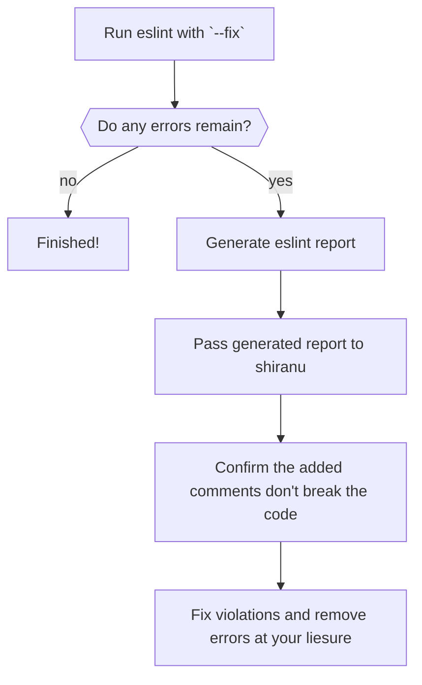

# shiranu
A tool to add ignore statements based on eslint output.
> 知らぬが仏・Shiranuga hotoke
>
> Ignorance is Bliss

Inspired by [suppress-eslint-errors](https://github.com/amanda-mitchell/suppress-eslint-errors)

## usage
First run eslint on the code base with the appropriate arguments as well as specifying an output file in the JSON format.
```
yarn eslint src -f json -o eslint-result.json
```
Then pass the full path to the shiranu script
```
ruby shiranu.rb "full/path/to/eslint-result.json"
```
A comment ignoring any eslint error violations will be placed on the preceeding line, along with a comment encouraging the resolution of the violation.

For example, the following code violates the eqeqeq rule:
```js
 isFoo(string) {
    return string == "foo";
  }
```
After running the script this will be changed to:
```js
  isFoo(string) {
    // TODO: Fix this the next time the file is edited.
    // eslint-disable-next-line eqeqeq
    return string == "foo";
  }
```

## motivation
Bring linting into a legacy code base can be tricky as there could be many existing violations that the team do not have time to resolve right now. For Ruby code bases Evil Martians outline a [strategy here](https://evilmartians.com/chronicles/rubocoping-with-legacy-bring-your-ruby-code-up-to-standard). However that strategy does not work for eslint. A file can either be ignored completely so that it will not be linted for any issues, or a rule can be disabled completely.

## expected flow


## TODO
- Handle multiple exemptions per line
- Handle adding ignore statements to .jsx, .tsx and vue templates
- Add tests
- Allow ignoring warnings
- Call eslint from the script itself?
